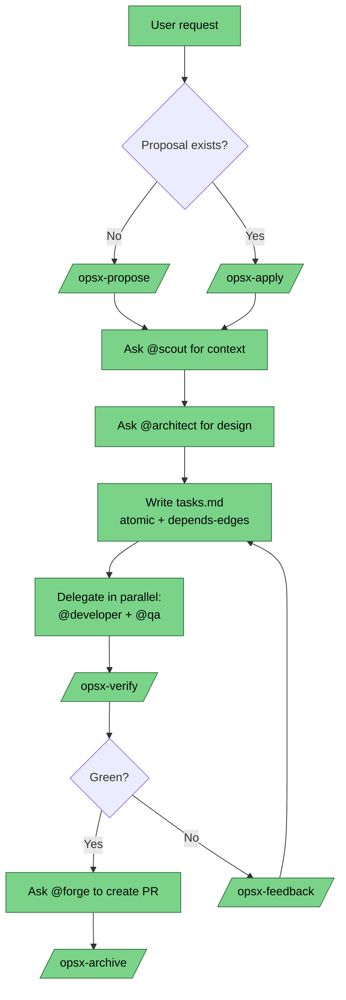
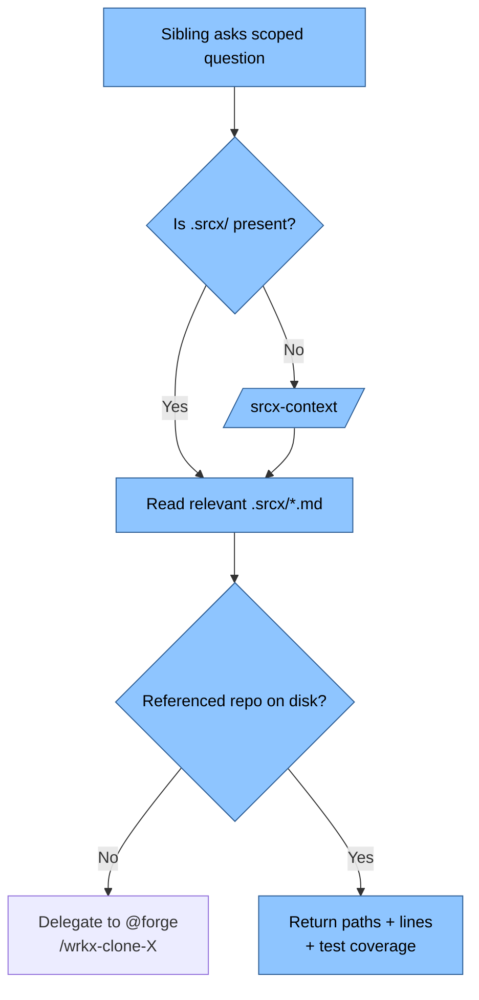
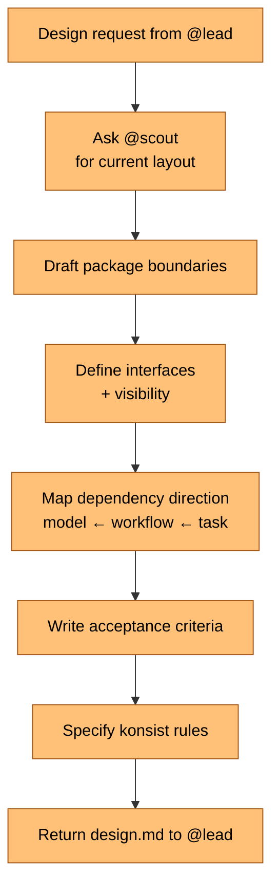
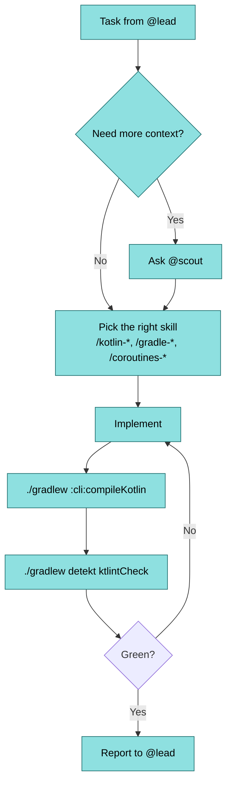
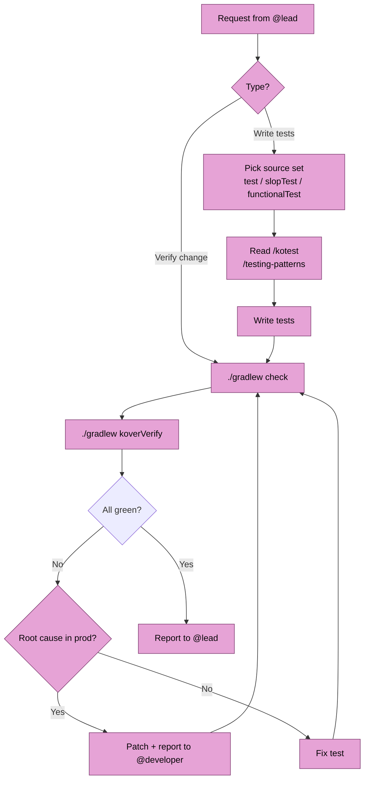
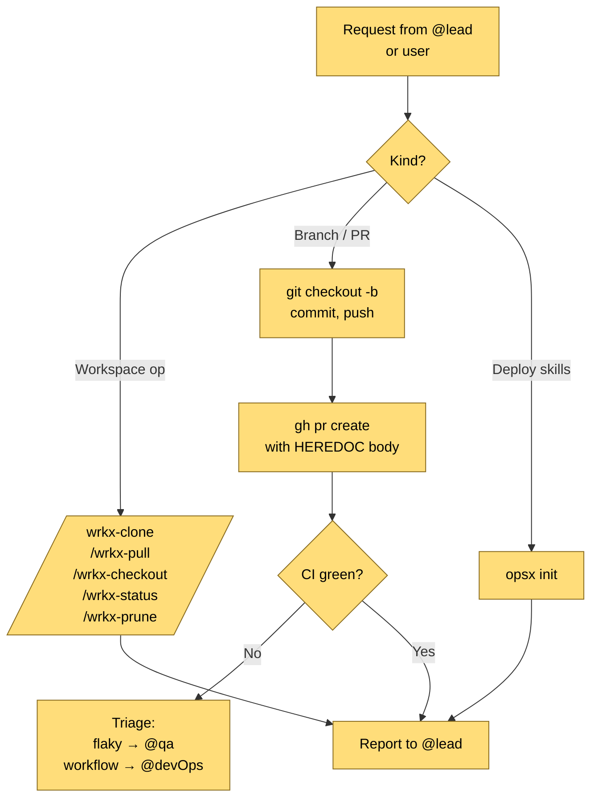
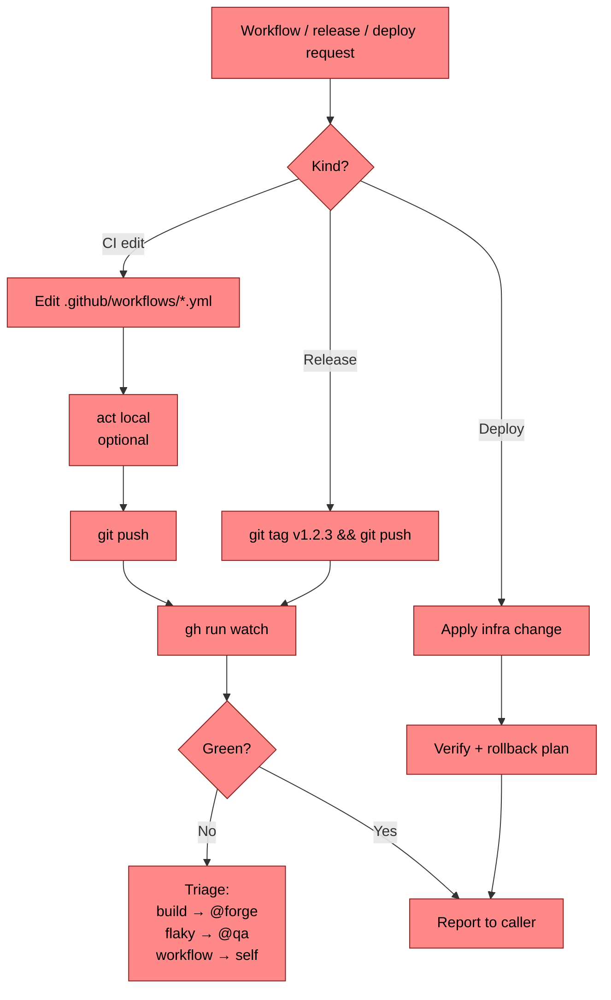
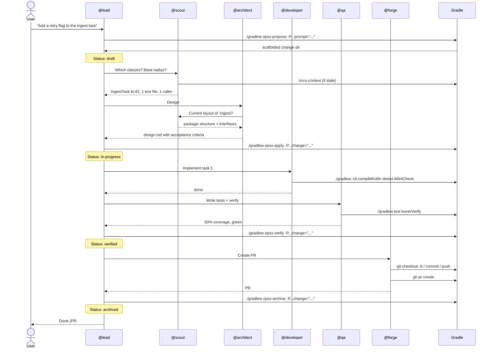

# opsx Agent System

opsx ships **seven agent personas** that coordinate the change
lifecycle. A user prompt lands on `@lead` — the orchestrator — which
delegates context, design, implementation, testing, and repo work
to specialists. Every persona has a fixed skill roster declared in
[`manifest.json`](../manifest.json), and the persona definitions
themselves live in [`agents/`](../agents/).

On `opsx init` these files are copied into the consumer
workspace under `.claude/`, `.github/`, `.codex/`, `.opencode/` so
every AI CLI sees the same cast.

## Orchestration topology

```mermaid
graph TD
    User([User prompt]) ==> Lead
    Lead[@lead<br/>Orchestrator]:::lead ==> Scout[@scout<br/>Context]:::scout
    Lead ==> Architect[@architect<br/>Design]:::arch
    Lead ==> Developer[@developer<br/>Code]:::dev
    Lead ==> QA[@qa<br/>Tests + Verify]:::qa
    Lead ==> Forge[@forge<br/>Build + PR]:::forge
    Lead ==> DevOps[@devOps<br/>CI/Release]:::ops
    Architect -.consults.-> Scout
    Developer -.consults.-> Scout
    QA -.consults.-> Scout
    QA -.patches.-> Developer
    Forge -.coordinates.-> DevOps
    classDef lead fill:#7bd389,stroke:#2d6e3e,color:#000
    classDef scout fill:#8ec5ff,stroke:#2d5d94,color:#000
    classDef arch fill:#ffc078,stroke:#a35817,color:#000
    classDef dev fill:#8ee0e0,stroke:#1e6e6e,color:#000
    classDef qa fill:#e6a3d6,stroke:#803e73,color:#000
    classDef forge fill:#ffdd7a,stroke:#8a6c1f,color:#000
    classDef ops fill:#ff8888,stroke:#8a2020,color:#000
```

Solid arrows = delegation. Dotted arrows = sibling consultation.

## The seven personas

| Agent | Color | Role | Jump to |
|---|---|---|---|
| `@lead` | green | Tech Lead — orchestrates the change lifecycle | [#lead](#lead--tech-lead) |
| `@scout` | blue | Codebase Scout — answers "where is X" and blast-radius questions | [#scout](#scout--codebase-scout) |
| `@architect` | orange | Application Architect — writes `design.md`, defines boundaries | [#architect](#architect--application-architect) |
| `@developer` | cyan | Kotlin/JVM Developer — writes production code | [#developer](#developer--kotlinjvm-developer) |
| `@qa` | magenta | QA Guru — tests, verifies, enforces architecture rules | [#qa](#qa--qa-guru) |
| `@forge` | yellow | Build Engineer — Gradle, multi-repo, branches, PRs | [#forge](#forge--build-engineer) |
| `@devOps` | red | DevOps — CI/CD workflows, releases, deployment | [#devops](#devops--devops-engineer) |

---

## @lead — Tech Lead

```yaml
name: lead
description: >
  Orchestrates the full opsx change lifecycle (propose → apply →
  verify → archive) by delegating context, design, implementation,
  testing, and repo work to specialist agents.
color: green
```

**How to invoke.** Address it directly in the chat: `@lead …` or
type the opsx-managed slash commands (`/opsx-propose`,
`/opsx-apply`, …). In Claude Code, `@lead` activates the agent
defined in `.claude/agents/lead.md`.

**When to use.** Any time a user request requires planning,
breakdown into tasks, or coordination between specialists.
Examples: *"add a retry flag"*, *"rename module X to Y"*,
*"refactor the ingest pipeline"*.

**How to use.** State the goal in one sentence. `@lead` handles
the rest — scaffolding the change, delegating, verifying, and
archiving. Do not pre-assign sub-tasks; `@lead` will.

**Interacts with.**

| Sibling | Why |
|---|---|
| `@scout` | Ask for code context, blast radius, test coverage |
| `@architect` | Ask for design decisions, package layout, acceptance criteria |
| `@developer` | Assign Kotlin implementation tasks |
| `@qa` | Assign tests and full-change verification |
| `@forge` | Delegate branch/PR work and `opsx init` runs |
| `@devOps` | Delegate CI workflow and release-tag work |

**Flow.**



**Skills owned** (from `manifest.json`).

`/opsx-propose` · `/opsx-apply` · `/opsx-continue` · `/opsx-verify` ·
`/opsx-archive` · `/opsx-bulk-archive` · `/opsx-feedback` ·
`/opsx-ff` · `/opsx-onboard` · `/opsx-explore` · `/opsx-status`

---

## @scout — Codebase Scout

```yaml
name: scout
description: >
  Explores and maps code structure, dependencies, and blast radius
  using srcx-generated context files under .srcx/.
color: blue
```

**How to invoke.** Another agent mentions `@scout` or the user
types `/srcx-context` / `/srcx-clean` directly.

**When to use.** Whenever an agent needs to know what's in the
code: which classes, which tests, what depends on what, where a
function lives, how large a blast radius is. Never grep by hand
when `@scout` can answer.

**How to use.** Ask a scoped question: *"Which classes call
`IngestTask.fetch()`?"*, *"What tests cover `Manifest.parse()`?"*,
*"What's the blast radius of renaming `OpsxConfig`?"*.

**Interacts with.**

| Sibling | Why |
|---|---|
| `@lead`, `@architect`, `@developer`, `@qa` | They ask; `@scout` answers |
| `@forge` | Delegates to `@forge` when a wrkx-managed repo is missing on disk |

**Flow.**



**Skills owned.** `/srcx-context` · `/srcx-clean`

**Reference skills read.** `/package-structure` · `/konsist`

---

## @architect — Application Architect

```yaml
name: architect
description: >
  Designs package structure, API boundaries, dependency direction,
  plugin topology, and produces design.md blueprints.
color: orange
```

**How to invoke.** `@lead` delegates to `@architect` when a design
decision is needed. Users can address it directly for an
architectural sanity check.

**When to use.** Anything that affects code shape beyond a single
file: new packages, new interfaces, plugin topology, dependency
direction, a konsist rule worth enforcing.

**How to use.** Describe the problem and the constraints. Expect a
`design.md` back with package layout, interface signatures,
acceptance criteria, and konsist rules.

**Interacts with.**

| Sibling | Why |
|---|---|
| `@scout` | Consults before any cross-package design decision |
| `@lead` | Receives requests; returns design artifact |
| `@developer` | Reviews implementation against the design |
| `@qa` | Hands over konsist rules to enforce |

**Flow.**



**Skills owned.**

`/package-structure` · `/naming-conventions` · `/konsist` ·
`/kotlin-functional-first` · `/gradle-plugins-basics` ·
`/gradle-custom-plugins` · `/gradle-settings-plugin`

---

## @developer — Kotlin/JVM Developer

```yaml
name: developer
description: >
  Writes production code in src/main/ following functional-first,
  unidirectional data-flow conventions.
color: cyan
```

**How to invoke.** `@lead` assigns a task. Users can address
directly for focused Kotlin work.

**When to use.** Writing or editing Kotlin in `src/main/`. Building
a new feature, fixing a bug, implementing what `@architect`
designed.

**How to use.** Hand over explicit file paths and what to change.
`@developer` does not explore — it asks `@scout` when it needs
more context.

**Interacts with.**

| Sibling | Why |
|---|---|
| `@lead` | Receives assigned tasks |
| `@scout` | Consults instead of grepping |
| `@qa` | Hands off after detekt + ktlint pass |

**Flow.**



**Skills owned** (31 total; grouped).

- **Kotlin core**: `/kotlin-lang` · `/kotlin-functional-first` ·
  `/kotlin-conventions` · `/kotlin-dsl-builders` ·
  `/kotlin-multiplatform` · `/kotlin-dsl`
- **Layout**: `/naming-conventions` · `/package-structure`
- **Coroutines**: `/kotlinx-coroutines` · `/coroutines-suspend-functions` ·
  `/coroutines-scopes` · `/coroutines-context-dispatchers` ·
  `/coroutines-cancellation-exceptions` · `/coroutines-shared-state` ·
  `/coroutines-channels-select` · `/coroutines-flow` ·
  `/coroutines-stateflow-sharedflow`
- **Libraries**: `/kotlinx-serialization` · `/exposed` · `/clikt`
- **Gradle**: `/gradle` · `/gradle-tasks` · `/gradle-plugins-basics` ·
  `/gradle-custom-plugins` · `/gradle-providers-properties` ·
  `/gradle-dependency-injection` · `/gradle-init-scripts` ·
  `/gradle-settings-plugin` · `/gradle-build-conventions` ·
  `/gradle-composite-builds`
- **Quality gates**: `/ktlint` · `/detekt`

---

## @qa — QA Guru

```yaml
name: qa
description: >
  Writes tests across unit (test), architecture (slopTest), and
  integration (functionalTest) source sets, enforces Konsist rules,
  checks Kover coverage, and patches production code when a bug
  surfaces during testing. The most capable coder on the team —
  knows everything @developer knows plus the testing and quality
  stack.
color: magenta
```

**How to invoke.** `@lead` delegates testing or verification.
Users can address directly for *"write tests for X"* or *"verify
this change"*.

**When to use.** Any testing task, coverage check, konsist
enforcement, or full-change verification via `/opsx-verify`. Also
the correct agent to patch a production bug discovered while
testing.

**How to use.** Tell `@qa` which change or function and which
source set (`test/`, `slopTest/`, `functionalTest/`). Expect exact
failure locations on any red run.

**Interacts with.**

| Sibling | Why |
|---|---|
| `@lead` | Receives verify requests |
| `@scout` | Consults for edge cases and call sites |
| `@developer` | Hands patches back for awareness |

**Flow.**



**Skills owned.** Everything in `@developer` **plus**:
`/testing-patterns` · `/kotest` · `/kover` ·
`/serialization-patterns` · `/konsist`

---

## @forge — Build Engineer

```yaml
name: forge
description: >
  Manages Gradle builds, multi-repo workspace via wrkx, git
  branches, and GitHub PRs via gh. Also runs opsx init to deploy
  agent/skill updates.
color: yellow
```

**How to invoke.** `@lead` delegates branch/PR work. Users can
address directly for *"open a PR"*, *"pull all repos"*, *"sync
skills"*.

**When to use.** Anything touching the build system or VCS:
`settings.gradle.kts`, `build.gradle.kts`, convention plugins,
`wrkx.json`, branches, pushes, PRs, releases. Also every
`opsx init` run.

**How to use.** State the op. `@forge` reports status after every
destructive operation and warns on uncommitted changes before a
prune/checkout/pull.

**Interacts with.**

| Sibling | Why |
|---|---|
| `@lead` | Receives repo-level tasks |
| `@devOps` | Coordinates release tags and CI failures |

**Flow.**



**Skills owned.**

`/gradle-composite-builds` · `/git-workflow` · `/gh-cli` ·
`/wrkx` · `/wrkx-clone` · `/wrkx-pull` · `/wrkx-checkout` ·
`/wrkx-status` · `/wrkx-prune` · `opsx init`

---

## @devOps — DevOps Engineer

```yaml
name: devOps
description: >
  Manages GitHub Actions CI/CD, release automation, Docker, and
  deployment.
color: red
```

**How to invoke.** `@lead` or `@forge` delegates when a `.github/workflows/`
change or release tag is needed.

**When to use.** CI workflow edits, release cuts (`v<semver>`
tags), deployment config, Docker/K8s manifests, secret rotation.

**How to use.** Describe the workflow, tag, or deployment
target. `@devOps` verifies the next CI run after any workflow
edit and always has a rollback plan.

**Interacts with.**

| Sibling | Why |
|---|---|
| `@forge` | Coordinates on release tags and build-script-adjacent CI failures |
| `@qa` | Receives flaky-test triage from CI failures |

**Flow.**



**Skills owned.** `/github-actions` · `/gh-cli` · `/git-workflow`

---

## Change lifecycle

A change moves through six statuses:

```
draft → active → in-progress → completed → verified → archived
```

Each change lives at `opsx/changes/<name>/` with `.opsx.yaml`,
`proposal.md`, `design.md`, `tasks.md`, and optional
`feedback.md`. The corresponding Gradle tasks live under the
`opsx` group — see [README.md §Tasks](../README.md#tasks).

### End-to-end sequence



## Worked example: "Add a retry flag to the ingest task"

This is the same flow as the sequence above, in narrative form.

1. **User** types in Claude Code:
   > @lead please add a `--retry=N` flag to the ingest Gradle
   > task, default 3, applied to the network fetch step.

2. **@lead** scaffolds the change:
   ```bash
   ./gradlew -q opsx-propose \
     -Pzone.clanker.opsx.prompt="Add --retry=N flag to ingest task, default 3"
   ```
   → `opsx/changes/add-retryn-flag-to-ingest-task/` created in
   `draft` status. `proposal.md`, `design.md`, `tasks.md`
   skeletons in place.

3. **@lead → @scout**: *"Which classes? Blast radius?"*
   @scout reads `.srcx/context.md` and reports:
   - `ingest/src/main/kotlin/zone/clanker/ingest/task/IngestTask.kt:42` — the target
   - `ingest/src/test/…/IngestTaskTest.kt` — existing tests
   - Call sites: one, in `ingest/src/main/…/IngestWorkflow.kt:18`

4. **@lead → @architect**: *"Design."*
   @architect consults @scout for current shape, then writes
   `design.md`:
   - Add `retries: Property<Int>` on `IngestTask` with `.convention(3)`.
   - Wire through the provider chain to the network fetch step.
   - Acceptance: retry count honoured in both CLI (`--retries=5`)
     and programmatic use.

5. **@lead** produces `tasks.md`:
   - [ ] `a1b2c3d4e5` Add `retries: Property<Int>` with default 3
   - [ ] `b2c3d4e5f6` Plumb into the fetch step
   - [ ] `c3d4e5f6g7` Unit test: `retries=5` honoured
   - [ ] `d4e5f6g7h8` Unit test: default honoured when flag omitted
   - [ ] `e5f6g7h8i9` detekt + ktlint + kover green

6. **@lead** runs apply:
   ```bash
   ./gradlew -q opsx-apply -Pzone.clanker.opsx.change="add-retryn-flag-to-ingest-task"
   ```
   Status → `in-progress`.

7. **@lead → @developer**: *"Implement tasks 1 and 2."*
   @developer reads `/gradle-providers-properties`, edits
   `IngestTask.kt`, runs `./gradlew :ingest:compileKotlin :ingest:detekt :ingest:ktlintCheck` — green.

8. **@lead → @qa**: *"Write tests 3 and 4; verify the whole change."*
   @qa reads `/kotest` + `/testing-patterns`, writes the two
   tests in `src/test/`, runs
   `./gradlew :ingest:test :ingest:koverVerify` — 93% coverage,
   green.

9. **@lead** verifies:
   ```bash
   ./gradlew -q opsx-verify -Pzone.clanker.opsx.change="add-retryn-flag-to-ingest-task"
   ```
   Status → `verified`.

10. **@lead → @forge**: *"Open PR."*
    @forge branches (`feat/ingest-retries`), commits, pushes,
    and opens the PR with `design.md` content in the body.
    After merge, @lead runs:
    ```bash
    ./gradlew -q opsx-archive -Pzone.clanker.opsx.change="add-retryn-flag-to-ingest-task"
    ```
    Change moves to `opsx/archive/add-retryn-flag-to-ingest-task/`.
    Status → `archived`.

## Unowned reference skills

These six skills ship in `opsx/skills/` and are deployed by
`opsx init`, but **no persona in `manifest.json` owns them**. Any
agent may read them on demand; they act as a shared library.

| Skill | Purpose | Why unowned |
|---|---|---|
| `/ai-cli-subagents` | Authoring user-defined subagents for AI coding CLIs (frontmatter schema, file locations) | Meta-skill about agents themselves — shared reference, not a domain task |
| `/charm-glow` | [glow](https://github.com/charmbracelet/glow) terminal markdown rendering | Optional tooling — no persona's critical path |
| `/charm-gum` | [gum](https://github.com/charmbracelet/gum) shell script UX primitives | Optional tooling |
| `/charm-skate` | [skate](https://github.com/charmbracelet/skate) key-value store CLI | Optional tooling |
| `/charm-vhs` | [vhs](https://github.com/charmbracelet/vhs) terminal GIF recorder | Optional tooling |
| `/go` | Go language reference | No Go persona yet — keep the skill available |

If one of these becomes central to a workflow, promote it by
adding it to the appropriate persona's `skills` list in
`manifest.json`.

## Where this fits

- Agent definitions: [`agents/`](../agents/)
- Skill definitions: [`skills/`](../skills/)
- Manifest binding them: [`manifest.json`](../manifest.json)
- Sync pipeline: `opsx/src/main/kotlin/zone/clanker/opsx/skill/SkillGenerator.kt`
- Lifecycle tasks: `opsx/src/main/kotlin/zone/clanker/opsx/task/`
- Plugin README: [`README.md`](../README.md)
