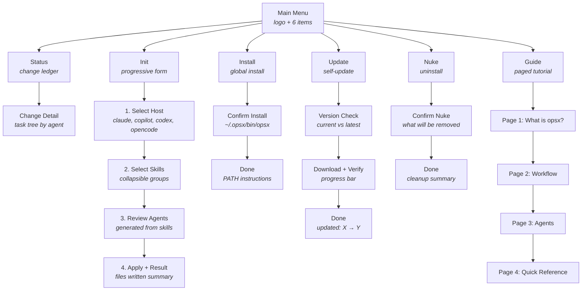

# TUI Navigation Map

## Global Rules

Every screen has a **status bar** pinned to the bottom row:
- **Left side**: contextual controls (navigation hints, toggle keys, action keys)
- **Right side**: `opsx v0.0.5-SNAPSHOT` (always shows software version)
- **Color**: dark green background, bold white text (matches the logo)

The status bar is the only place for controls — no inline instructions.

## Navigation Flow



---

## Screens

### Main Menu
- Logo (bright green ASCII art)
- 6 items: status, init, install, update, nuke, guide
- Status bar left: `↵ select  ↑/k up  ↓/j down  q quit`
- Status bar right: `opsx v{version}`

### Status

**Ledger** (default):
- Header: `opsx  status  {N} changes`
- Each row: `[badge]  ██░░░ 40% (4/10)  change-name`
- Cursor navigable, Enter drills into detail
- Shows current project name at the top
- Empty state: "No changes found — use /opsx-propose to start one"
- Status bar left: `↵ open  ↑/k up  ↓/j down  r refresh  ← back`

**Detail** (drill-down):
- Header: `opsx  status  →  {change-name}`
- Badge + progress bar
- Activity events grouped by agent, colored by agent
- Status bar left: `← h back`
- Status bar right: `{done}/{total} tasks  opsx v{version}`

### Init

Progressive form — each step is a screen:

**Step 1 — Select Host**:
- List: claude, copilot, codex, opencode
- Single select (for now; multi-select later)
- Auto-detects which hosts have their CLI on PATH
- Status bar left: `↵ select  ↑/k up  ↓/j down  ← back`

**Step 2 — Select Skills**:
- Skills grouped by category in collapsible sections
- Categories: kotlin, gradle, testing, git, ci/cd, coroutines, serialization, etc.
- All checked by default
- Space toggles, Enter confirms
- Each skill shows its description
- Status bar left: `space toggle  ↵ confirm  a all  n none  ← back`

**Step 3 — Review Agents**:
- Shows which agents will be generated based on selected skills
- Agent name + list of skills it will carry
- Read-only review before applying
- Status bar left: `↵ apply  ← back`

**Step 4 — Result**:
- Per-host summary: files written, markers placed, external commands run
- Cleanup summary if legacy paths were removed
- Status bar left: `↵ done`

**Config file**: `~/.opsx/config.json` — persists host + skill selections so re-running
`opsx init` in a new repo uses the same preferences without re-selecting.

```json
{
  "version": 1,
  "defaultHost": "claude",
  "skills": {
    "kotlin": ["kotlin-lang", "kotlin-functional-first", "kotlin-conventions"],
    "gradle": ["gradle", "gradle-build-conventions", "gradle-composite-builds"],
    "testing": ["kotest", "konsist", "kover", "testing-patterns"],
    "git": ["git-workflow", "gh-cli", "github-actions"],
    "serialization": ["kotlinx-serialization", "serialization-patterns"]
  },
  "agents": ["lead", "scout", "forge", "developer", "qa", "architect", "devOps"]
}
```

### Install
- Shows current install location (or "not installed")
- Copies dist to `~/.opsx/` (bin + lib)
- Wires PATH in shell rc if needed
- Sets up zsh completion
- Status bar left: `↵ install  ← back`

### Update
- Shows current version and checks latest from GitHub releases
- If update available: shows diff, downloads with progress bar, verifies checksum
- If current: "up to date ✓"
- Status bar left: `↵ update  ← back` (or just `← back` if current)

### Nuke
- Shows what will be removed: `~/.opsx/bin/opsx`, PATH block in shell rc
- Requires confirmation (press y or Enter on "confirm")
- Does NOT walk projects to remove emitted files
- Status bar left: `y confirm  n cancel`

### Guide
- 4 pages, navigable with ←/→ or Enter
- Page 1: What is opsx — one paragraph
- Page 2: The workflow — propose → apply → verify → archive
- Page 3: Agents — who does what
- Page 4: Quick reference table — commands and slash commands
- Status bar left: `← prev  → next  q back`
- Status bar right: `page {n}/4  opsx v{version}`

---

## Future: ~/.opsx/ Directory Structure

```
~/.opsx/
├── bin/
│   └── opsx                    # installed binary
├── lib/
│   └── opsx.jar                # JVM payload
├── config.json                 # user preferences (hosts, skills, agents)
├── plugins/                    # future: installable plugins
├── skills/                     # future: custom user skills
├── agents/                     # future: custom user agents
└── _opsx                       # zsh completion script
```

This is the global home for opsx. Per-repo state stays in `.opsx/` inside the project.
The tool is version-dependent — `config.json` carries a version field so migrations
can be handled on update.

---

## Open Questions

<!-- Add your notes here — what do you want changed, added, or reconsidered? -->

